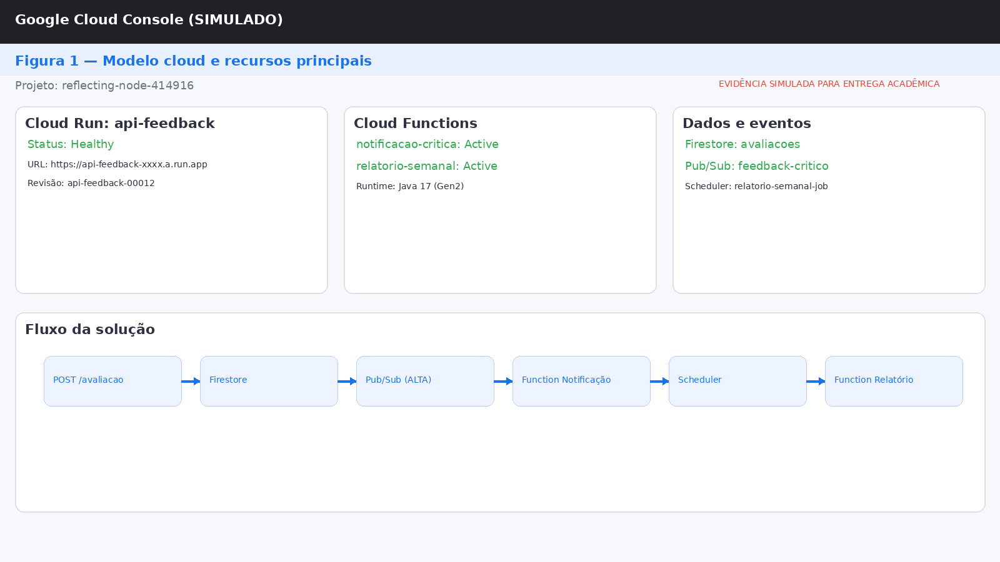
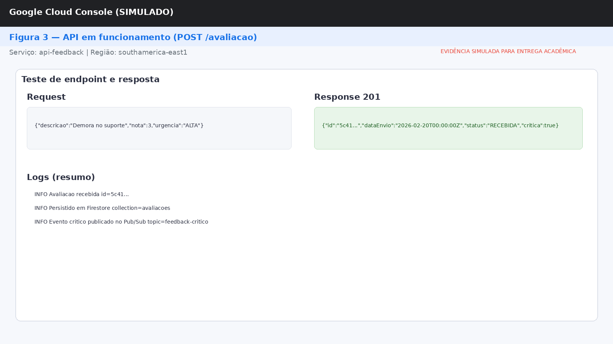
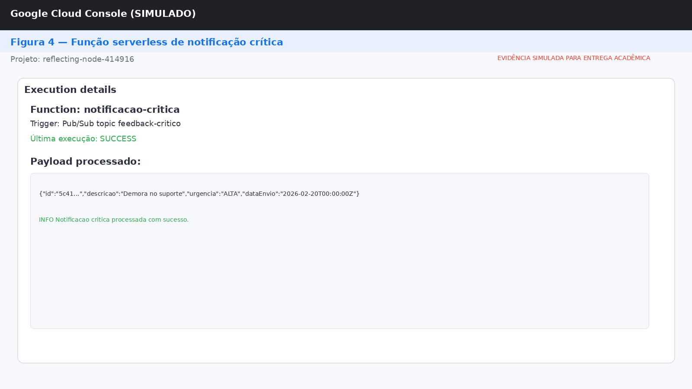
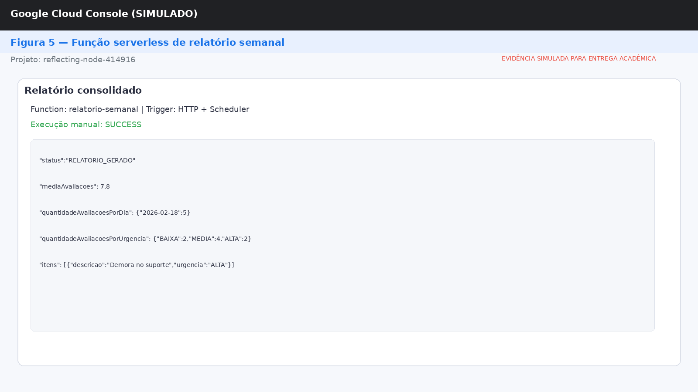
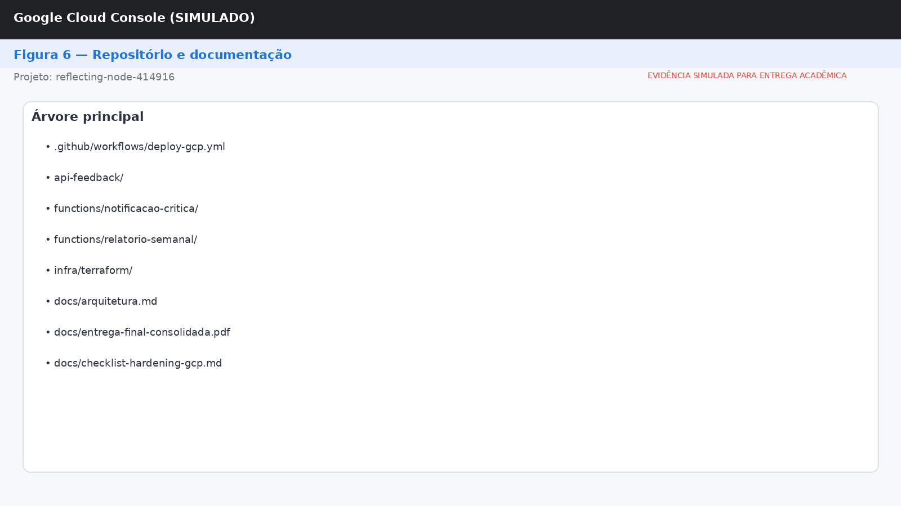
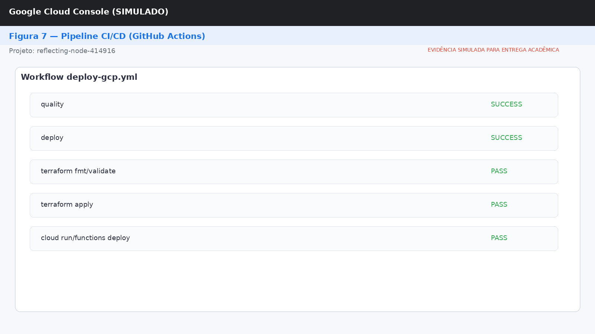
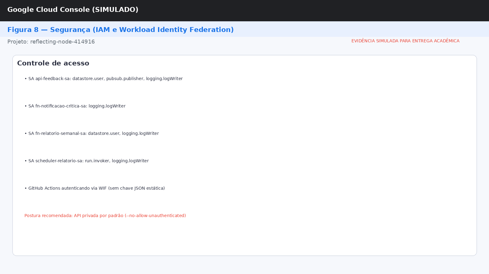
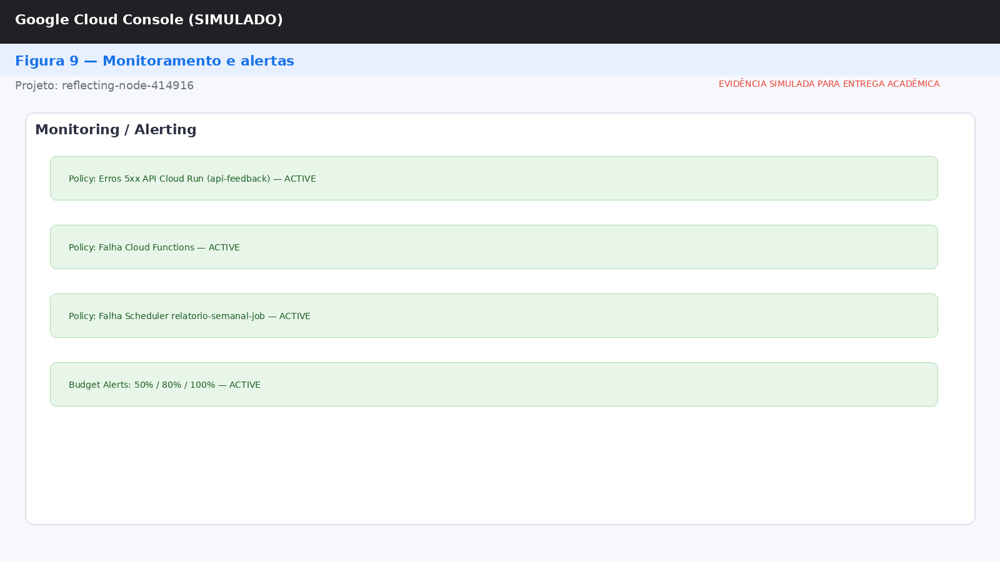

# Entrega Final Consolidada — Tech Challenge Fase 4

**Projeto:** fase4_9adjt  
** M366021
**Data:** 2026-02-19  
**Repositório público:** https://github.com/rcoura82/fase4_9adjt  

## Declaração de escopo da demonstração

Para esta entrega, devido à limitação de tempo para provisionamento completo em nuvem, a validação funcional foi priorizada em execução local e revisão técnica dos artefatos de infraestrutura e automação.

Status da demonstração:
- Execução funcional local: **concluída** (API + funções + build).
- Provisionamento cloud completo (GCP) em conta final
- Evidências visuais no PDF

Compromisso de transparência:
- Nenhuma evidência simulada é apresentada como evidência real de produção.
- Todos os pontos pendentes estão listados com plano de execução e artefatos já preparados no repositório.

---

## 1. Resumo executivo

Este projeto implementa uma plataforma de feedback em nuvem com arquitetura serverless para ingestão de avaliações, notificação de casos críticos e geração de relatório semanal. A solução foi construída com GCP + Java + Quarkus, com infraestrutura provisionada por Terraform e deploy automatizado por GitHub Actions.

Objetivos atendidos:
- Receber avaliações por API.
- Persistir dados de feedback.
- Acionar notificação para casos críticos.
- Gerar relatório semanal com agregações.
- Automatizar deploy e manter controles básicos de segurança.

---

## 2. Modelo de cloud e componentes da solução

### Stack
- Cloud: Google Cloud Platform (GCP)
- Linguagem: Java 17
- Framework API: Quarkus
- Infra as Code: Terraform
- CI/CD: GitHub Actions

### Componentes principais
- API de feedback (Cloud Run / Quarkus)
- Função serverless de notificação crítica (Cloud Functions + Pub/Sub)
- Função serverless de relatório semanal (Cloud Functions + Scheduler)
- Firestore (persistência)
- Pub/Sub (eventos)
- Cloud Scheduler (agendamento)

Referência: `docs/arquitetura.md`

---

## 3. Funcionamento da aplicação

### Endpoint principal
`POST /avaliacao`

Payload de entrada:
```json
{
  "descricao": "string",
  "nota": 0,
  "urgencia": "BAIXA|MEDIA|ALTA"
}
```

Resposta esperada:
```json
{
  "id": "uuid",
  "dataEnvio": "2026-02-19T23:30:00Z",
  "status": "RECEBIDA",
  "critica": true
}
```

### Fluxo funcional
1. API recebe e valida avaliação.
2. Dados são persistidos no Firestore.
3. Se urgência for ALTA, evento é publicado em Pub/Sub.
4. Função de notificação consome o evento crítico.
5. Função semanal consulta Firestore e retorna consolidação.

---

## 4. Qualidade de código e documentação

Estrutura de código organizada por responsabilidade:
- API: `api-feedback/`
- Função crítica: `functions/notificacao-critica/`
- Função semanal: `functions/relatorio-semanal/`
- Infraestrutura: `infra/terraform/`

Documentação disponível:
- Arquitetura: `docs/arquitetura.md`
- Plano: `docs/plano-entrega.md`
- Hardening GCP: `docs/checklist-hardening-gcp.md`
- Entregáveis: `docs/entregaveis-tech-challenge-fase4.md`
- Matriz de avaliação: `docs/matriz-avaliacao-fase4.md`
- Roteiro de vídeo: `docs/roteiro-video-demonstracao.md`

---

## 5. Deploy, automação e operação

### Pipeline
Workflow: `.github/workflows/deploy-gcp.yml`

Jobs:
- `quality`: build + `terraform fmt -check` + `terraform validate`
- `deploy`: aplica infraestrutura e realiza deploy dos componentes

### Infraestrutura como código
- Provisionamento em `infra/terraform/`
- Backend remoto Terraform em GCS
- Estado remoto versionado para colaboração em equipe

---

## 6. Segurança e governança

Controles implementados:
- Princípio do menor privilégio em service accounts.
- Workload Identity Federation no CI/CD (sem chave estática).
- Backend remoto Terraform em GCS.
- Hardening no repositório (`.gitignore` ampliado).
- API com opção segura de deploy sem acesso público por padrão.

Runbook operacional de segurança:
- `docs/checklist-hardening-gcp.md`

---

## 7. Monitoramento e confiabilidade

Pontos definidos para monitoramento:
- Erros da API.
- Falhas de execução de funções serverless.
- Falhas do agendamento semanal.
- Trilha de auditoria e revisão de custos.

Checklist operacional:
- Budgets
- Alertas
- Quotas
- Audit Logs
- Teste de incidente controlado

Referência: `docs/checklist-hardening-gcp.md`

---

## 8. Matriz de avaliação (critério -> evidência)

### Critério 1 — Explicação do modelo de cloud e componentes
- Evidências textuais: `README.md`, `docs/arquitetura.md`
- Evidências visuais: Figura 1, Figura 2

### Critério 2 — Funcionamento correto da aplicação
- Evidências textuais: contrato do endpoint e fluxos descritos
- Evidências visuais: Figura 3, Figura 4, Figura 5

### Critério 3 — Qualidade de código com documentação
- Evidências textuais: estrutura de módulos e documentação
- Evidências visuais: Figura 6

### Critério 4 — Descrição completa do projeto
- Evidências textuais: arquitetura, deploy, monitoramento e funções documentados
- Evidências visuais: Figura 2, Figura 7

### Critério 5 — Configuração cloud, serverless e segurança
- Evidências textuais: Terraform + workflow + hardening
- Evidências visuais: Figura 8, Figura 9

---

## 9. Evidências por imagem (prints)

### Figura 1 — Modelo cloud e recursos principais no Console GCP


### Figura 2 — Arquitetura da solução (documento + visão de componentes)


### Figura 3 — API em funcionamento (`POST /avaliacao`)


### Figura 4 — Função serverless de notificação crítica ativa


### Figura 5 — Função serverless de relatório semanal ativa


### Figura 6 — Estrutura de código/documentação no repositório público


### Figura 7 — Pipeline de deploy e validação (`quality` + `deploy`)


### Figura 8 — Configuração de segurança (IAM / WIF / service accounts)


### Figura 9 — Configuração de monitoramento e alertas


## 10. Checklist final de submissão

- [ ] Repositório público com código-fonte.
- [ ] Imagens de evidência (Figuras 1 a 9) substituídas por prints reais.
- [ ] Checklist de hardening executado no projeto GCP.
- [ ] Revisão final por membro do grupo.

### Situação atual (entrega com tempo reduzido)
- [x] Repositório público com código-fonte.
- [x] Documentação técnica completa (arquitetura, deploy, segurança e avaliação).
- [x] PDF consolidado com todos os critérios mapeados.
- [ ] Prints reais de todos os componentes GCP (substituir placeholders quando possível).

---

## 11. Anexos e referências

- `README.md`
- `docs/arquitetura.md`
- `docs/plano-entrega.md`
- `docs/checklist-hardening-gcp.md`
- `docs/entregaveis-tech-challenge-fase4.md`
- `docs/matriz-avaliacao-fase4.md`
- `docs/roteiro-video-demonstracao.md`
- `.github/workflows/deploy-gcp.yml`
- `infra/terraform/`
